# RangeWatch

**Living species distribution models, continuously updated from GBIF & iNaturalist.**

RangeWatch maps where a species lives, where it has already established outside its native
range, and where the climate could support it next, and keeps those models current as new
records arrive. Pick a species. Occurrences are pulled from GBIF (primary) and iNaturalist (supplementary), a
MaxEnt model (`elapid`) is trained on a versioned WorldClim bioclim stack with spatial block
cross-validation, and suitability, MESS extrapolation, range zones and a transparent severity
index are projected globally and published as map tiles and a PDF bulletin. Tracked species are
re-checked for new records and **retrained only when warranted**, with every model version
logged (MLflow + model-lineage table) for reproducibility.

The science is standard (MaxEnt + bioclim + MESS); the contribution is the MLOps layer —
persistence, incremental ingestion, conditional retraining, lineage, automated bulletins — and a
React frontend.

```
React SPA (TanStack Router/Query/Table/Form/Store, MapLibre + deck.gl, shadcn/ui)
   │  typed client generated from FastAPI's OpenAPI schema
   ▼
FastAPI ──► Celery (Redis) ──► Prefect flows: raw_occurrences → features → model → suitability_raster → bulletin
   │                                   │
   │                                   ├─ connectors: pygbif / pyinaturalist
   │                                   ├─ features: rasterio (versioned 19-band COG)
   │                                   ├─ modeling: elapid MaxEnt, spatial CV, MESS, severity
   │                                   └─ persistence: PostGIS · artifact volume · MLflow
   ▼
pg_tileserv (occurrence / native-range vector tiles) · titiler (suitability / MESS / zones COG tiles)
```

## Screenshots

Captured from the local Docker stack (WorldClim v2.1 at 10′, `bioclim_v2`) on 3 Oct 2026.

**Species registry.** Every tracked species with its live pipeline status, severity, record count
and current model version. Rows update as jobs run.

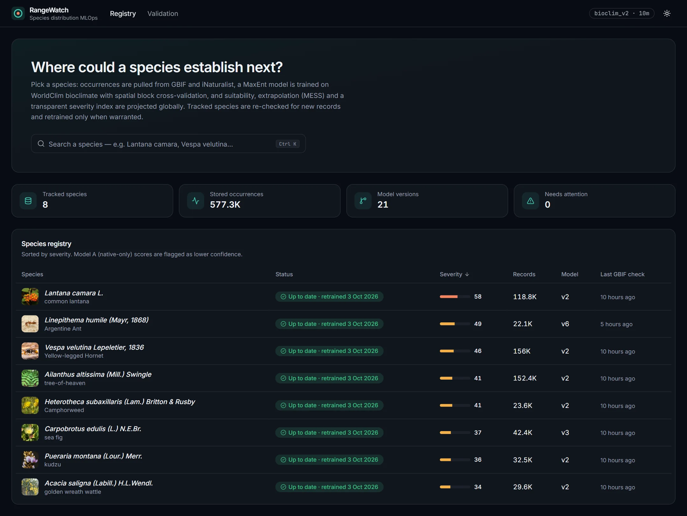

**Species page: observed vs. projected.** *Linepithema humile* (Argentine ant). Left: GBIF +
iNaturalist occurrences coloured by range label, aggregated at low zoom, with a year slider and the
confirmed native-range polygon. Right: MaxEnt suitability with the MESS extrapolation overlay on by
default. The transferability caveat and model type (A/B) are always shown with the map.

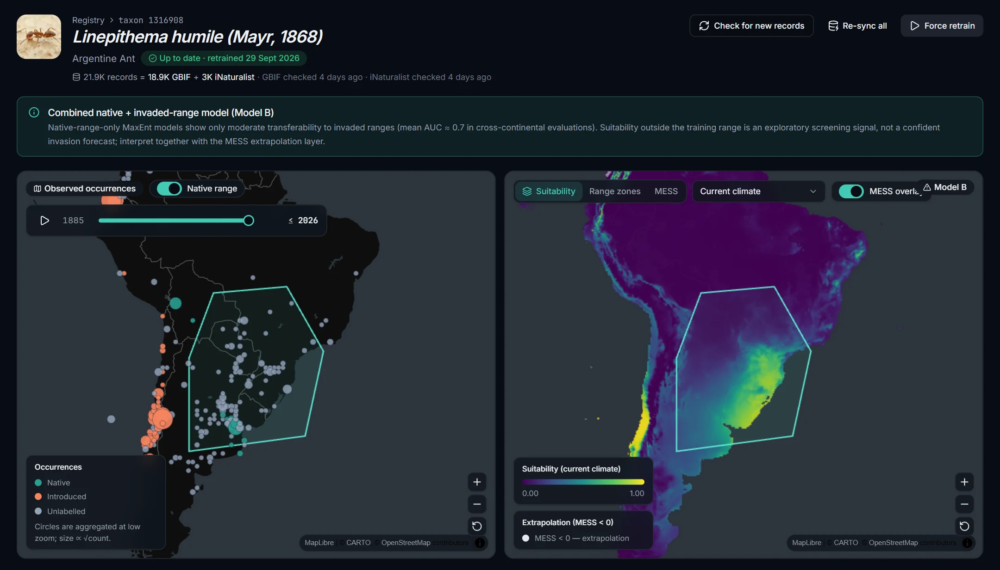

**Model diagnostics.** Spatial-block-CV CBI/AUC/TSS, candidate invasion area, the share of that area
inside the training climate, the documented severity composite, permutation importance, the invasion
timeline and per-fold CV scores.

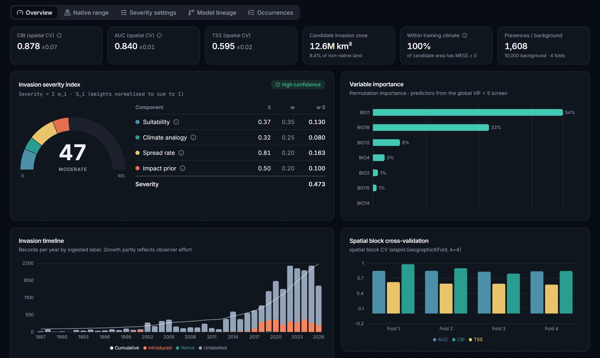

**Projection layers.** The right-hand map switches between suitability, range zones and the raw MESS
surface, plus any future-climate scenarios. Top: range zones for *Lantana camara* (native range /
established elsewhere / candidate expansion). Bottom: the MESS surface for *Vespa velutina*. Red
cells lie outside the climate the model was trained on.

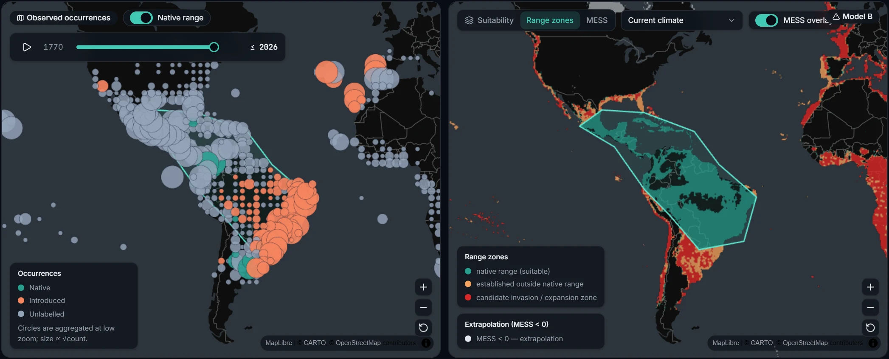
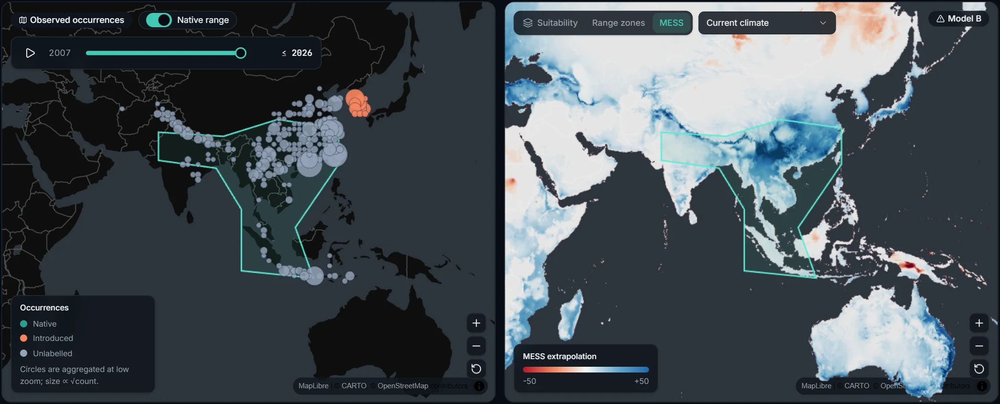

**Extrapolation diagnostics.** MESS only asks whether some predictor is outside its training
range. Every model also gets four more diagnostics. **Extrapolation** on the projection map
opens any of them, and the overview tab's *Extrapolation diagnostics* card lists each one's rule,
threshold and how much land and candidate zone it flags:

| Diagnostic | What it detects | Flags a cell when |
| --- | --- | --- |
| MESS (Elith et al. 2010) | a predictor outside its training range | MESS < 0 |
| exDet (Mesgaran et al. 2014) | NT1: range overshoot; NT2: novel *combinations* of in-range values (broken correlations), which MESS misses | NT1 < 0 or NT2 > 1 |
| MOP (Owens et al. 2013; `mop` R package) | mean z-scored distance to the closest 1% of training conditions | distance > threshold |
| Shape (Velazco et al. 2024; `flexsdm`) | Mahalanobis distance to the nearest training point relative to the training spread | value > threshold |
| AOA (Meyer & Pebesma 2021; `CAST`) | distance in the importance-weighted predictor space the model uses | DI > threshold |

All five share the MESS reference set (training presences + background). exDet keeps its
published cut-offs. The MOP and Shape papers publish no fixed threshold, so they use the AOA rule:
score each training point against the other spatial CV folds and take the outlier-trimmed
maximum, min(Q75 + 1.5·IQR, max). The **consensus** layer (`consensus.tif`) counts how many of
the five flag each cell. The map overlay can show that graded haze instead of the MESS < 0 mask.
The consensus also sets the severity **confidence** label (never the score). Defaults:
low for Model A, or when more than 25% of the candidate zone is flagged by at least 3 of the 5
methods; moderate when more than 10% is, or when less than 60% is flagged by none; otherwise
high. All three thresholds can be changed in the Severity settings form. Models trained before
the diagnostics existed fall back to the MESS-extrapolated share with the same thresholds.

**Native-range review.** A draft polygon is proposed heuristically, but nothing is trained until a
user edits and confirms it (vertex editing, move, multi-part areas).

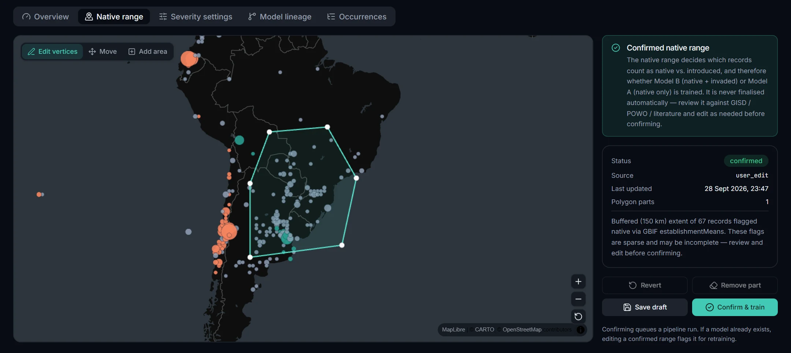

**Severity settings.** The severity index is a documented weighted composite. Weights and priors
are editable and re-score the current model immediately.

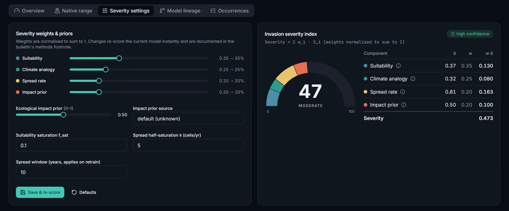

**Model lineage.** Every version with its retrain trigger, CV metrics and full reproducibility
record (bioclim version + SHA-256, GBIF citation/DOI, package versions, seeds, MLflow run). The
table scrolls horizontally to show every field.

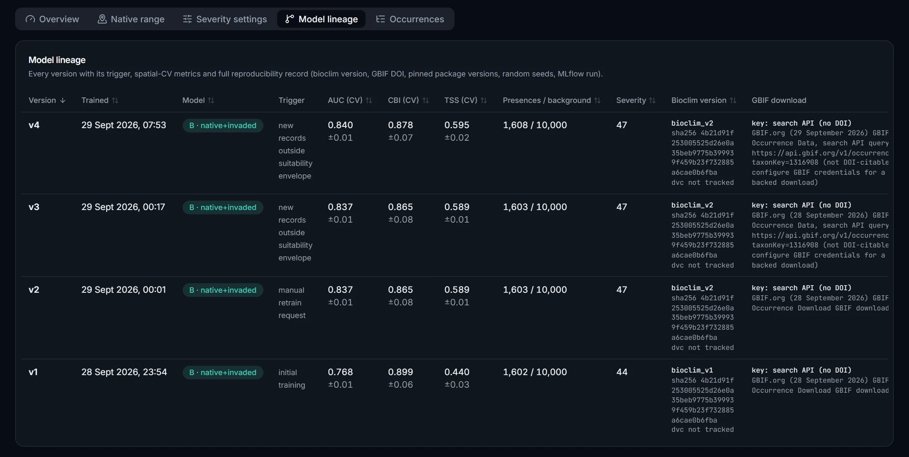

**Validation suite.** Six reference invaders checked against documented invaded and control
regions, plus the independent native-only → invaded transferability test.

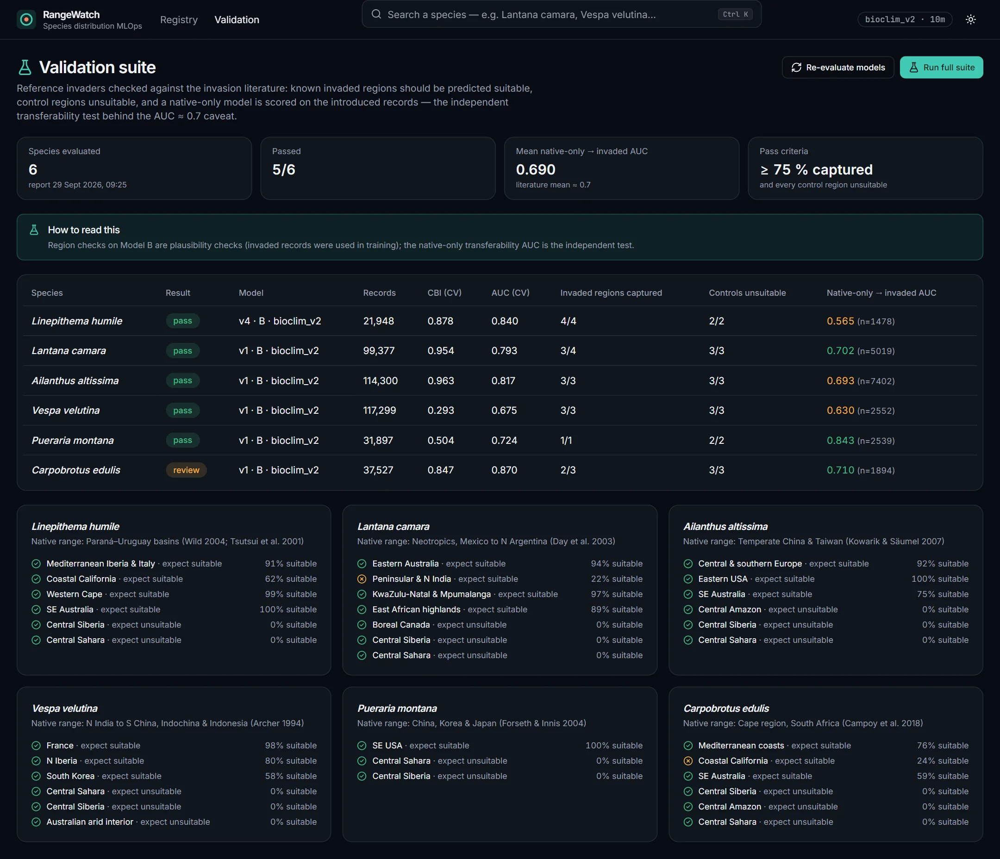

**PDF bulletin.** Server-rendered for every model version (Jinja2 → WeasyPrint): executive summary,
transferability caveat, maps with MESS hatching, severity breakdown and methods/reproducibility
pages. Shown here: the first two pages for *Lantana camara*.

<p>
  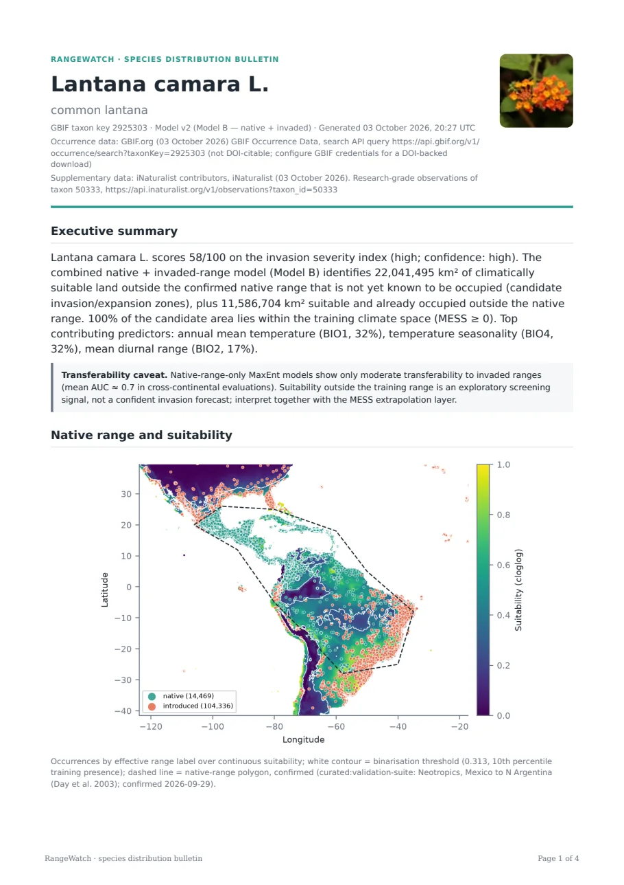
  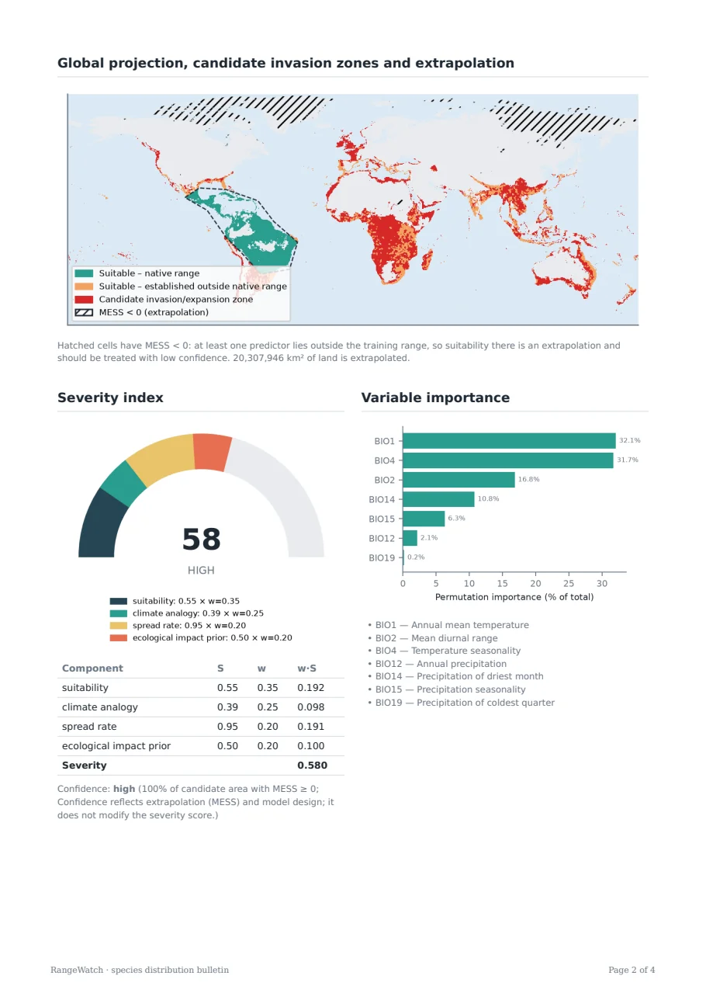
</p>

## Results

Current model of each tracked species, from the same 10′ run (4 Oct 2026, the first with the
advanced extrapolation diagnostics). All models are **Model B** (native + invaded records),
since every species has documented introduced occurrences. Metrics are spatial-block-CV means
(k = 4). *Candidate zone* means climatically suitable land outside the native range that is not
yet known to be occupied. *MESS ≥ 0* is the share of that zone inside the training ranges;
*≥ 3 of 5* is the share flagged as extrapolation by at least three of the five diagnostics. The
consensus sets the confidence label but never changes the severity score.

| Species | Ver. | Records | CBI | AUC | TSS | Severity | Candidate zone | MESS ≥ 0 | ≥ 3 of 5 | Confidence |
|---|---|---:|---:|---:|---:|---:|---:|---:|---:|---|
| *Lantana camara* (common lantana) | v3 | 118,825 | 0.953 | 0.758 | 0.406 | **57** high | 42.2 M km² (30.3 %) | 48.4 % | 54.3 % | **low** |
| *Linepithema humile* (Argentine ant) | v7 | 22,054 | 0.870 | 0.795 | 0.499 | **49** moderate | 15.2 M km² (10.1 %) | 100.0 % | 0.3 % | high |
| *Carpobrotus edulis* (sea fig) | v4 | 42,440 | 0.949 | 0.771 | 0.454 | **48** moderate | 34.9 M km² (22.7 %) | 84.6 % | 14.1 % | **moderate** |
| *Ailanthus altissima* (tree-of-heaven) | v3 | 152,870 | 0.986 | 0.746 | 0.381 | **42** moderate | 6.0 M km² (4.0 %) | 99.9 % | 0.2 % | high |
| *Heterotheca subaxillaris* (camphorweed) | v3 | 23,607 | -0.022 | 0.640 | 0.435 | **41** moderate | 59.1 M km² (39.3 %) | 70.2 % | 9.8 % | high |
| *Vespa velutina* (yellow-legged hornet) | v3 | 156,048 | 0.460 | 0.718 | 0.402 | **40** moderate | 7.6 M km² (5.2 %) | 98.5 % | 0.6 % | high |
| *Pueraria montana* (kudzu) | v3 | 32,499 | 0.597 | 0.700 | 0.365 | **36** moderate | 5.2 M km² (3.5 %) | 99.6 % | 0.1 % | high |
| *Acacia saligna* (golden wreath wattle) | v3 | 29,608 | 0.969 | 0.854 | 0.606 | **34** moderate | 4.0 M km² (2.6 %) | 99.9 % | 0.0 % | high |

Percentages in *Candidate zone* are of non-native land. Higher versions were retrained by the
incremental pipeline (new records outside the suitability envelope, or a manual retrain). This
run was also the first with target-group background for every species except *Linepithema
humile*, which changed several candidate zones substantially (e.g. *Lantana camara* 22.6 → 42.2 M
km²). The zone maps below come from the earlier uniform-background run.

**Global range zones** (from the generated bulletins). Teal: suitable within the confirmed native
range (dashed). Orange: suitable and already occupied outside it. Red: candidate
invasion/expansion zone. Hatched: MESS < 0 (extrapolation).

| | |
|---|---|
| 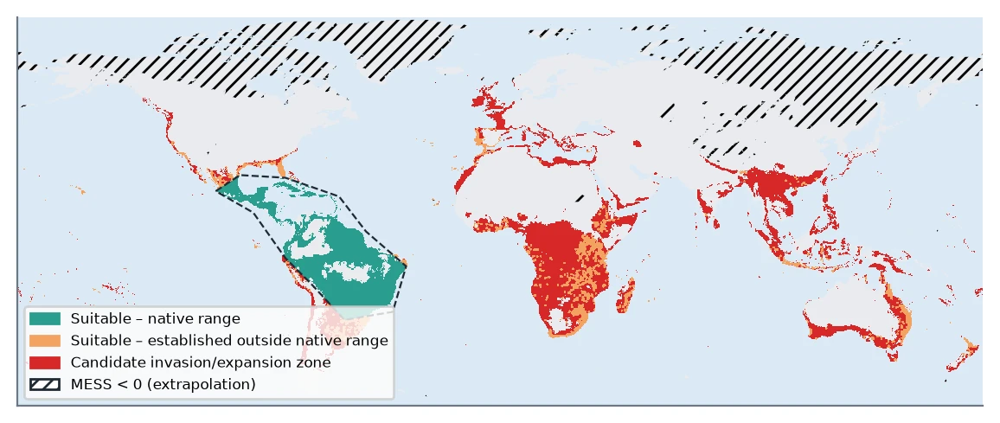 *Lantana camara*: the widest candidate zone in the registry, across sub-Saharan Africa, South/Southeast Asia and eastern Australia. | 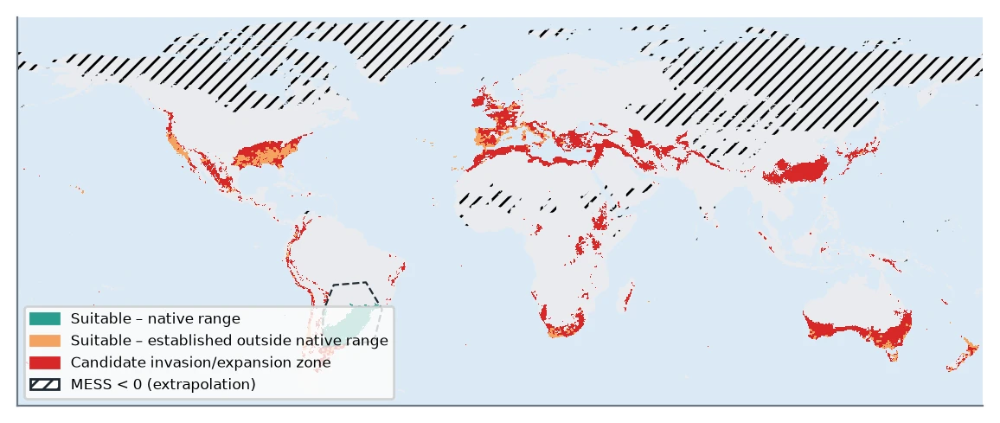 *Linepithema humile*: Mediterranean-climate belts on every continent, consistent with its known supercolonies. |
| 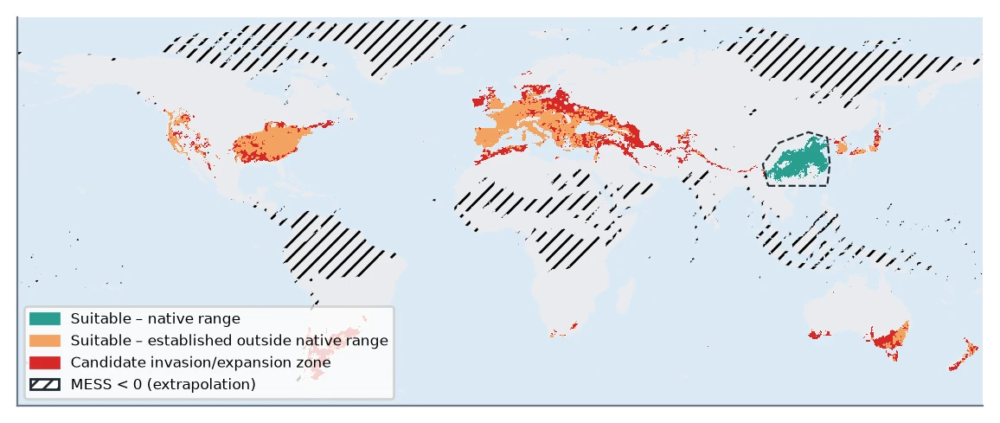 *Ailanthus altissima*: already occupies most of its suitable temperate range in Europe and the eastern USA (orange). | 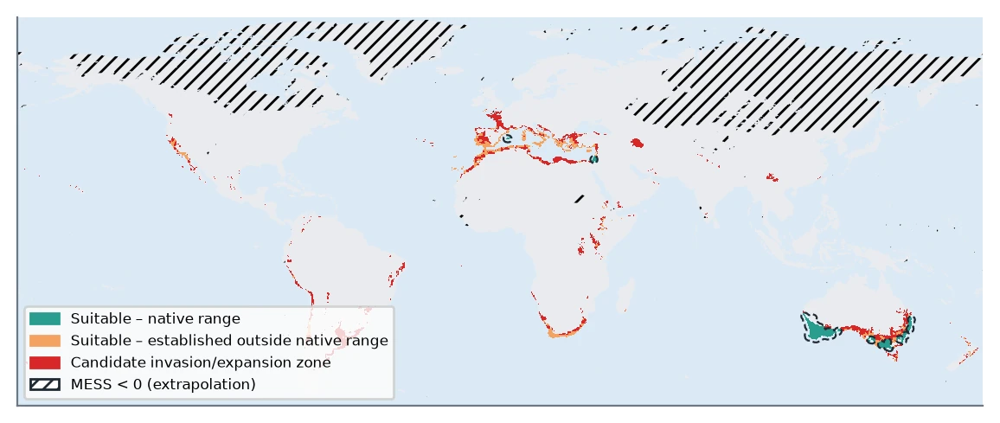 *Acacia saligna*: a narrow Mediterranean-climate niche, with the Mediterranean basin, South Africa and Chile/California as candidate zones. |
| 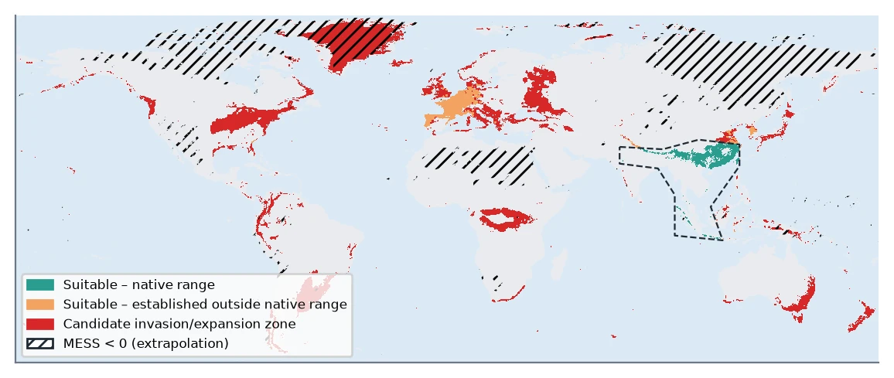 *Vespa velutina*: the Greenland "candidate zone" lies under MESS hatching. It is an extrapolation artefact, not a forecast. | 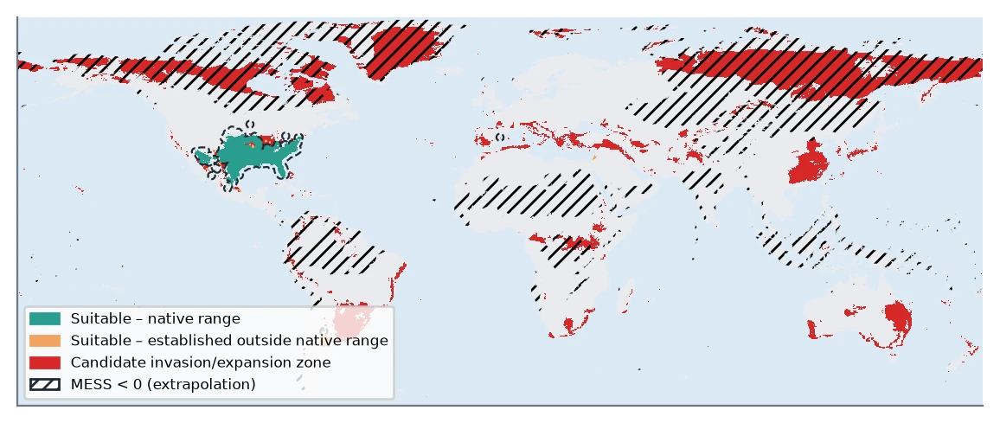 *Heterotheca subaxillaris* (earlier run): most of the candidate zone (Siberia, Canada) was MESS-extrapolated. |

What the run shows:

- **Strong fits** (CBI > 0.9): *Acacia saligna, Ailanthus altissima, Lantana camara* and
  *Carpobrotus edulis*. Presences are concentrated where the model predicts high suitability.
- **Weak fits are visible, not hidden.** *Vespa velutina* (CBI 0.46) is still spreading fast in
  Europe and is far from climatic equilibrium. *Heterotheca subaxillaris* has a CBI of −0.02: the
  model does no better than random at ranking its presences, whatever the confidence label says.
- **Extrapolation drives confidence.** *Lantana camara*'s candidate zone is now 54 % robustly
  extrapolated (≥ 3 of 5 diagnostics), so it is labelled **low** confidence; *Carpobrotus edulis*
  (14 %) is **moderate**. Severity scores are unchanged by this, as CLAUDE.md constraint 2
  requires. *Heterotheca subaxillaris* shows where the methods disagree: 30 % of its candidate
  zone has MESS < 0, but the distance-based diagnostics (MOP, Shape, AOA) flag only 3–12 %,
  so just 9.8 % reaches the ≥ 3-of-5 consensus and the label is high.
- **Transferability matches the literature.** In the validation suite, native-only models scored
  on introduced records averaged AUC **0.690** (0.565–0.843 per species) against the published
  mean of ≈ 0.7. That is why every projection carries the transferability caveat. Five of six
  reference invaders pass the known-range check; see [Validation suite](#validation-suite-workplan-phase-11).

## Quick start (Docker)

```bash
cp .env.example .env            # optional: add GBIF credentials for DOI-backed downloads
docker compose up -d --build
# one-time global static layer (10′ ≈ 50 MB for a quick start; 2.5m recommended for production)
docker compose run --rm api python -m src.features.bioclim_store build --version bioclim_v1 --resolution 10m
```

The `frontend` Nginx container is the **single public entry point** (`SDM_GATEWAY_PORT`,
default 8080). It serves the SPA and proxies the API and both tile servers on the same origin;
every other service binds to `127.0.0.1` only. Upstreams are re-resolved per request (the
container's own nameserver, or `SDM_DNS_RESOLVER`), so recreating `api`, `titiler` or
`pg_tileserv` never needs a gateway restart; on Kubernetes the upstreams are therefore FQDNs.

| Path / service                        | URL                                                                  |
| ------------------------------------- | -------------------------------------------------------------------- |
| Dashboard                             | http://localhost:8080                                                |
| API + OpenAPI docs                    | http://localhost:8080/api/docs                                       |
| Raster / vector tiles                 | `/tiles/raster/…` (titiler) · `/tiles/vector/…` (pg_tileserv) |
| MLflow · Prefect UI (localhost only) | http://127.0.0.1:5000 · http://127.0.0.1:4200                       |

**Authentication:** set `SDM_AUTH_USER` and `SDM_AUTH_PASSWORD` in `.env` to require HTTP Basic
auth for the dashboard, API and tiles (the browser reuses the credentials for tile requests
because everything is same-origin). Leave them empty for local use.

Then search a species in the dashboard → **Start analysis** → review/edit the proposed native
range → **Confirm & train**. Progress, status badges and layers update live.

**GBIF credentials** (`SDM_GBIF_USER/PWD/EMAIL`) switch first-time ingestion to the
DOI-backed download API (the citable route). Without them the paged search API is used — it
works, but is capped (`SDM_GBIF_SEARCH_MAX_RECORDS`, default 100k) and not DOI-citable; the
bulletin says so explicitly.

## Development

```bash
# backend (Python 3.11+)
cd backend && python -m venv .venv && .venv/Scripts/pip install -e ".[dev]"   # or bin/ on Unix
python -m pytest            # offline: GBIF/iNat are faked, a synthetic bioclim stack is generated
ruff check src tests && black --check src tests
uvicorn src.api.main:app --reload

# frontend
cd frontend && npm ci
npm run gen:api:backend     # export OpenAPI from the backend + regenerate src/api/schema.d.ts
npm run dev                 # http://localhost:5173
npm test && npm run typecheck && npm run build
```

Regenerate the API types after **every** backend schema change — frontend types are never
hand-written.

### Frontend dev server

`npm run dev` proxies `/api`, `/tiles/raster` and `/tiles/vector` to the locally published
service ports (see `vite.config.ts`), mirroring the production gateway, so the app only ever
uses same-origin relative URLs.

### Global static layer (versioned, immutable)

```bash
python -m src.features.bioclim_store build --version bioclim_v1 --resolution 2.5m
python -m src.features.bioclim_store derive --from bioclim_v1 --version bioclim_v2 --core bio1,bio12
python -m src.features.bioclim_store add-scenario --version bioclim_v2 --gcm ACCESS-CM2 --ssp ssp245 --period 2041-2060
python -m src.features.bioclim_store add-hires --version bioclim_v2 --resolution 30s   # optional, ≈10 GB download
python -m src.features.bioclim_store build-chelsa --version chelsa_v1 --match bioclim_v2  # optional, ≈5 GB download
```

`SDM_BIOCLIM_VERSION` selects the active version. A version is never modified once a model has
used it — change the predictor screening or source by creating a new tag (`derive`), which the
model lineage then records. Scenarios and high-resolution companions (`add-hires`) are the
additive exceptions: they are projection inputs only and never change what a model was trained
on. `build-chelsa` creates a separate version (see *Climate-data cross-check*).

### Data versioning (DVC + per-model training snapshots)

Two kinds of data, versioned by the tool that fits each:

| Data                                                                              | Versioned by                                                                             | Where                                                                                                             |
| --------------------------------------------------------------------------------- | ---------------------------------------------------------------------------------------- | ----------------------------------------------------------------------------------------------------------------- |
| Global static layer (`data/bioclim/<version>/`: stack, metadata, scenario COGs) | **DVC** — `data/bioclim/<version>.dvc` pointers in git, content in an S3 remote | `dvc-remote` service (local) / S3 in production                                                                 |
| Occurrences                                                                       | append-only PostGIS rows with`ingested_ts`                                             | `occurrences`                                                                                                   |
| Exact training set of each model version                                          | **immutable snapshot, SHA-256 in the lineage**                                     | `artifacts/species/<taxon>/v<N>/training_data.parquet` + `occurrence_manifest.parquet`, also logged to MLflow |
| Models and projections                                                            | `model_versions` + MLflow registry                                                     | `artifacts/species/<taxon>/v<N>/`                                                                               |

Per-species data is deliberately **not** in DVC: it is appended nightly by the service, is
independently versioned per species, and PostGIS is its system of record — a git commit per
species per night would duplicate that. What cannot be re-derived from append-only rows (the
labels implied by the native-range polygon at training time, the seeded thinning and background
sample) is what the per-version snapshot captures. Every model's lineage shows
`bioclim_sha256`, `bioclim_dvc_md5` and the two snapshot hashes, so a version can be reproduced
with `dvc pull` + its snapshot. Curated native-range polygons (a few KB of GeoJSON) stay in git,
which diffs them better than DVC would.

One-time setup (DVC as an isolated tool; keys live only in `.env` and `.dvc/config.local`, both
git-ignored):

```bash
uv tool install "dvc[s3]"                       # or: pipx install "dvc[s3]"
# .env: SDM_DVC_ACCESS_KEY / SDM_DVC_SECRET_KEY (random values; see .env.example)
docker compose --profile dvc up -d dvc-remote   # S3 gateway on 127.0.0.1:7070 (versitygw)
dvc remote modify --local storage access_key_id     "$SDM_DVC_ACCESS_KEY"
dvc remote modify --local storage secret_access_key "$SDM_DVC_SECRET_KEY"
dvc pull                                        # restore data/bioclim/* on a new machine
```

After building a new version (or adding a scenario to one):

```bash
dvc add data/bioclim/bioclim_v3 && dvc push
git add data/bioclim/bioclim_v3.dvc && git commit -m "bioclim_v3: <what changed>"
```

For production, point the remote at real object storage (`dvc remote modify storage url s3://<bucket>/sdm-dvc` and drop `endpointurl`), with credentials from the environment.

### Climate scenarios ("what-if")

After `add-scenario`, project existing models without retraining — from the species page
(**Climate scenarios** card), via `POST /api/species/{taxon_key}/scenarios`, or automatically in
the nightly sweep. Every scenario gets its **own** MESS extrapolation mask
(`extrapolation_<scenario>.tif`) and diagnostic consensus (`consensus_<scenario>.tif`); future
climates leave the training range far more often, so the current-climate masks are never reused.

### High-resolution regions (30″)

`add-hires` attaches a finer stack of the **same** source (WorldClim 30″) to a version; it is
refused for other sources, since predictors would change meaning. The species page's
**High-resolution detail** card then projects the current model inside the area shown on the
projection map (`POST /api/species/{taxon_key}/hires`, at most `SDM_HIRES_MAX_CELLS` cells,
≈ 33° × 33° at 30″). This is regional and on demand, not global: a global 30″ projection is
~0.9 billion cells per raster. The region gets its own suitability and MESS extrapolation COGs
(`*_hires_30s.tif`), drawn over the global layer with an outline and a **30″ detail** toggle. A
new region replaces the previous one. The model is still the one trained at the version's
resolution; only the projection is finer.

### Climate-data cross-check (CHELSA)

`build-chelsa` downloads CHELSA V2.1 BIO1–19 (1981–2010), applies each file's declared
scale/offset, converts BIO3 from a ratio to WorldClim's percent, average-resamples onto the
`--match` version's grid and masks it to that version's land cells. Set
`SDM_CROSSCHECK_BIOCLIM_VERSION=chelsa_v1`; the **Model lineage** tab then offers a cross-check
(`POST /api/species/{taxon_key}/crosscheck`). It refits the current version on CHELSA predictors
with the exact training set from its snapshot (same presences, background, feature classes,
regularisation and CV seed), then reports:

- per-predictor agreement, with a units-mismatch flag;
- both sets of spatial-CV AUC/CBI/TSS;
- Spearman ρ between the two suitability predictions;
- κ for the thresholded maps.

It ends with a verdict (`consistent` / `moderate` / `divergent`). The result is stored with the
model version (`crosscheck_<version>.json`) but never changes it. Low agreement is an uncertainty
to report next to MESS, mostly in complex terrain. It is not a reason to switch datasets
automatically.

### Validation suite (workplan phase 11)

```bash
docker compose run --rm worker python -m src.orchestration.validation_suite run   # or the UI: /validation
```

Six reference invaders (*Linepithema humile, Lantana camara, Ailanthus altissima, Vespa velutina,
Pueraria montana, Carpobrotus edulis*) are ingested and trained through the normal pipeline, then:

1. **Known-range check** — land in documented invaded regions should be suitable and control
   regions unsuitable (a plausibility check: Model B trains on invaded records).
2. **Native-only transferability test** — a Model A trained on native records only scores the
   introduced records (independent; compare with the literature's mean AUC ≈ 0.7).

The suite supplies coarse, literature-cited native-range outlines through the curated-polygon
route (`data/native_range_polygons/`); they are shown with their source in the editor and never
replace a polygon a user has edited or confirmed. Reports: `artifacts/validation/*.json`,
`GET /api/validation`, and the **Validation** page.

First run at 10′ (29 Sep 2026): 5/6 pass; mean native-only → invaded AUC 0.690 (per species
0.565–0.843), in line with the literature. *Carpobrotus edulis* is flagged for review: coastal
California scores 24 % suitable against the 25 % bar — the check box spans the Central Valley and
Sierra, while the plant is strictly coastal. The region was left as defined rather than tuned
after seeing the result; a coast-hugging outline would be the principled fix.

### Re-sync

**Re-sync all** on the species page (`full_resync: true`) re-fetches every record rather than
the watermark delta and appends what is missing — use it after an interrupted first ingest or
after the search-API cap changed. With GBIF credentials it is a fresh DOI-backed download (the
workplan's "periodic full refresh"), which also becomes the species' cited download; without
them it uses the capped search API. The retrain decision still only counts records actually new.

## Deployment on Kubernetes

`deploy/k8s/base` (kustomize) contains PostGIS, Redis, MLflow, Prefect, the API, Celery
worker/beat, titiler, pg_tileserv, the gateway + Ingress, an idempotent `db-migrate` Job
(`python -m src.persistence.migrate`) and a suspended `bioclim-build` Job (2.5′).
`deploy/k8s/overlays/kind` is a single-node smoke-test overlay (dev secrets, RWO volumes, 10′
layer). For production add an overlay with registry image tags, an out-of-band `sdm-secrets`
Secret, ReadWriteMany storage for `sdm-data` / `sdm-artifacts`, and the Ingress host/TLS.

```bash
kubectl kustomize deploy/k8s/overlays/kind | kubeconform -strict -summary   # schema check
kind create cluster --name sdm
# `kind load docker-image` fails on Docker Desktop's multi-platform image store
# ("content digest ... not found"); import a single platform instead:
for img in sdm-backend:dev sdm-frontend:dev; do
  docker save --platform linux/amd64 "$img" \
    | docker exec -i sdm-control-plane ctr -n k8s.io images import --snapshotter=overlayfs -
done
kubectl apply -k deploy/k8s/overlays/kind
kubectl -n sdm port-forward svc/gateway 8088:80
```

## Troubleshooting

- **Blank maps.** Browsers cap live WebGL contexts per page; maps release their contexts on
  unmount and show a *Reload map* overlay if the browser still drops one. If a tab has been open
  across a deployment, the banner *A newer version of the dashboard has been deployed* offers a
  reload (the build id is polled from `/version.json`).
- **Basemap missing** (offline / CARTO blocked): data layers keep rendering on a plain
  background and the map says so.

## How the lifecycle works

`backend/src/orchestration/pipeline.py` implements the CLAUDE.md contract verbatim:

1. **New species** → full ingest (download or sliced search + iNat, de-duplicated via the iNat
   id carried by GBIF's iNat dataset) → a **draft** native-range polygon → status
   `awaiting_native_range_review`. Nothing is trained until a user confirms the polygon.
2. **Known species** → incremental GBIF pull (`lastInterpreted` since the watermark) + iNat
   `updated_since`. No new records → cached results. Otherwise append (occurrences are
   append-only), advance the watermark, and **retrain if new/total > 5 % or any new record falls
   in a cell the current model rates unsuitable**; else flag `minor_update_pending`.
3. **Train & publish** → features → Model B (native + invaded) whenever introduced records exist,
   else Model A (lower confidence) → **target-group background** (below) → Wallace/ENMeval
   feature-class × regularisation grid selected
   by spatially block-cross-validated CBI → global suitability, MESS, extrapolation mask and zone
   COGs → severity → hashed training-data snapshot → MLflow run + `model_versions` row → bulletin.
   Runs are serialised per species (Postgres advisory lock): a second request for the same
   species waits, then sees the first run's result instead of training a duplicate version.

Celery beat runs the nightly refresh of all tracked species, a stale-job reaper and a weekly
storage-growth sweep. A retrain that fails keeps `retrain_needed` set, so the next run retries it
even though its triggering records are already stored. The frontend only follows job/registry
state: a Server-Sent Events stream (`GET /api/jobs/events`) pushes the job list whenever a
worker reports progress. If the stream drops, it falls back to polling. It never duplicates this
decision logic.

**Background (pseudo-absence) sampling.** By default (`SDM_BACKGROUND_METHOD=target_group`),
background points come from raster cells where GBIF holds records of the species' **order**
(`SDM_TARGET_GROUP_RANK`), within the same 500 km buffer around presences. The background then
carries the same observer bias as the presences. Effort comes from GBIF's map API density tiles
(record counts per pixel, at a zoom no coarser than the bioclim cells), not by paging records.
Cells are de-duplicated, so each sampled cell counts once, following the unique-localities
approach of Phillips et al. 2009. The pipeline falls back to the uniform buffered background,
and records why, when the order is unknown, the effort data is unreachable, or fewer than 500
cells have records. The method, target group, effort query and any fallback reason are logged
per version, shown verbatim in the lineage table, and written into the bulletin's methods
section.

**Storage growth.** Species with no user request (no job) for `SDM_ARCHIVE_INACTIVE_AFTER_DAYS`
(default 180; `0` disables) have their feature table moved to
`species/<taxon>/archive/features_<taxon>.parquet`, recompressed with zstd. It is a derived
cache that the next training run rewrites; training snapshots are never touched, since their
SHA-256 is part of the lineage. The nightly sweep does not count as a request.

## Where the scientific constraints live

| CLAUDE.md constraint         | Implementation                                                                                                                                                    |
| ---------------------------- | ----------------------------------------------------------------------------------------------------------------------------------------------------------------- |
| Transferability caveat       | `TRANSFERABILITY_CAVEAT` in every model's metrics → UI banner, map badge, bulletin                                                                             |
| MESS alongside projections   | `evaluation.mess` → `mess.tif` + `extrapolation.tif`; layers endpoint always pairs them; MESS overlay on by default; hatched in the bulletin. exDet / MOP / Shape / AOA (`evaluation.ExtrapolationReference`) → `exdet.tif`, `mop.tif`, `shape.tif`, `aoa_di.tif`, `consensus.tif`; map views, consensus overlay, bulletin table + map |
| Prefer Model B               | `maxent_trainer.select_model_type`; Model A labelled lower-confidence in API, UI, bulletin                                                                      |
| Spatial block CV             | `elapid.GeographicKFold` (`maxent_trainer.spatial_block_cv`)                                                                                                  |
| CBI with AUC/TSS             | `evaluation.continuous_boyce_index`; shown first in the UI                                                                                                      |
| Native range never automated | draft-only heuristics; training gated on confirmation; editable deck.gl layer                                                                                     |
| Severity not a black box     | `severity_index.py` documents each component; weights and confidence thresholds configurable in the UI and printed in the bulletin footnote; the extrapolation consensus (MESS for older models) affects *confidence*, never the score |

## Design decisions beyond the workplan

- **`backend/src/persistence/`** was added for the repository (PostGIS + in-memory for tests),
  artifact store and MLflow registry — the layer is in the architecture but had no folder.
- **GBIF search slicing.** The search API stalls beyond offset ~10 000 (responses trickle
  indefinitely), so the credential-less fallback bisects the query into lat/lon slices of
  ≤ 9 900 records (duplicates on boundaries removed by gbifID). Every GBIF call has a
  `(10 s, 60 s)` timeout and bounded retries. `lastInterpreted` only accepts day precision, so
  incremental windows are day-granular; re-seen records never count towards the 5 % delta.
- **Protected core predictors.** Plain VIF elimination on WorldClim drops every cold-limit
  variable (BIO1/5/6/10/11 are mutually collinear), which produced implausible boreal
  suitability for *Linepithema humile*. `bio1` + `bio12` are now always retained (VIF < 5 still
  holds). On that species spatial-CV AUC rose 0.77 → 0.84 and TSS 0.44 → 0.59, and boreal
  artefacts disappeared.
- **Seeded sampling.** `elapid.sample_geoseries` takes no seed and elapid 1.0.4 has no
  distance thinning, so both are implemented in `background_sampler.py` with logged seeds.
- **Sampling effort from GBIF density tiles.** A higher taxon such as an order has tens of
  millions of records, too many to page through the search API. The map API returns per-pixel
  counts for a region in ≤ 64 tiles. A small decoder (`connectors/mvt.py`) reads them without
  adding a vector-tile dependency. Across the 8 tracked species this adds 9–20 s per training
  run and yields 9 000–9 900 background cells each.
- **Search text in the URL.** The species search keeps its text in `?q=`, a root search
  param, so a search survives reloads, back/forward navigation and shared links.
- **Retrain threshold unchanged** (5 % delta or ≥ 1 new record outside the envelope,
  `SDM_RETRAIN_DELTA_FRACTION` / `SDM_ENVELOPE_MIN_OUTSIDE_POINTS`). Changing it is a
  reviewed decision per CLAUDE.md.

## Known limitations / next steps

- Basic auth protects a single-team deployment; multi-user roles (e.g. who may confirm a native
  range) would need an identity provider in front of the gateway.
- Without GBIF credentials, species above `SDM_GBIF_SEARCH_MAX_RECORDS` are sampled
  proportionally per spatial slice — geographically balanced, but not the complete, DOI-citable
  dataset.
- The retrain trigger fires when ≥ 1 new record falls outside the suitability envelope
  (`SDM_ENVELOPE_MIN_OUTSIDE_POINTS=1`, per the CLAUDE.md contract). For heavily recorded species
  this retrains on most nightly checks; raising it is a reviewed decision.
- The local stack runs the 10′ climate layer; production should build 2.5′ (Kubernetes
  `bioclim-build` Job default).
